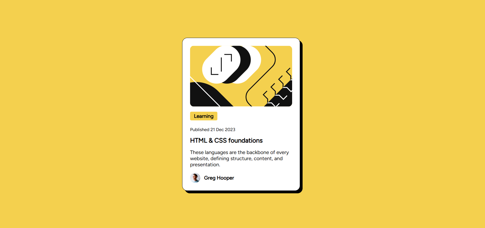

# Frontend Mentor - Blog Preview Card Solution
This is a solution to the [Blog preview card challenge on Frontend Mentor](https://www.frontendmentor.io/challenges/blog-preview-card-ckPaj01IcS). Frontend Mentor challenges help you improve your coding skills by building realistic projects.

## Overview

### Screenshot

### Links

Solution URL:

Live URL:

## My process

### Built with
-Semantic HTML 5

-CSS

-Flexbox

### What I Learnt

-How to link Google Fonts API to my HTML file

'''html
 <link rel="stylesheet" href="https://fonts.googleapis.com/css?family=Figtree">

### Useful Resources

https://developers.google.com/fonts/docs/getting_started - This guide helped me easily add Google Fonts to my web page

## Author

Charity Karoki

## Acknowledgeents

Frontend Mentor - https://www.frontendmentor.io/challenges/blog-preview-card-ckPaj01IcS
